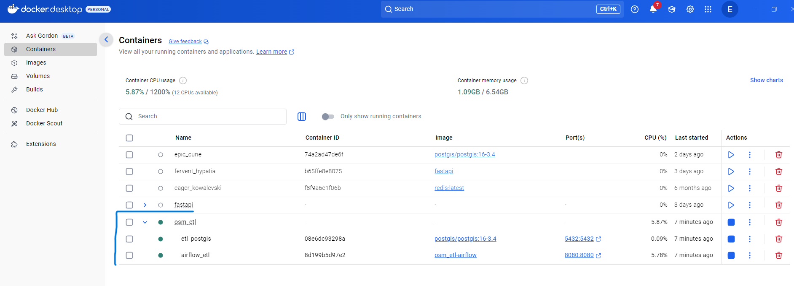
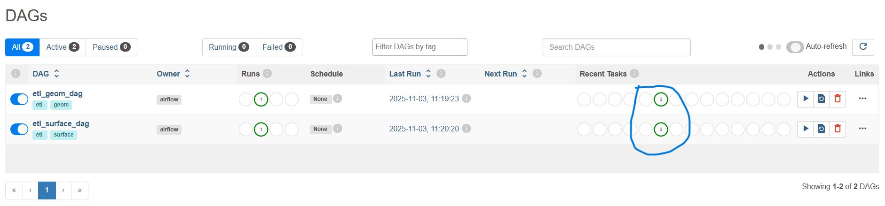
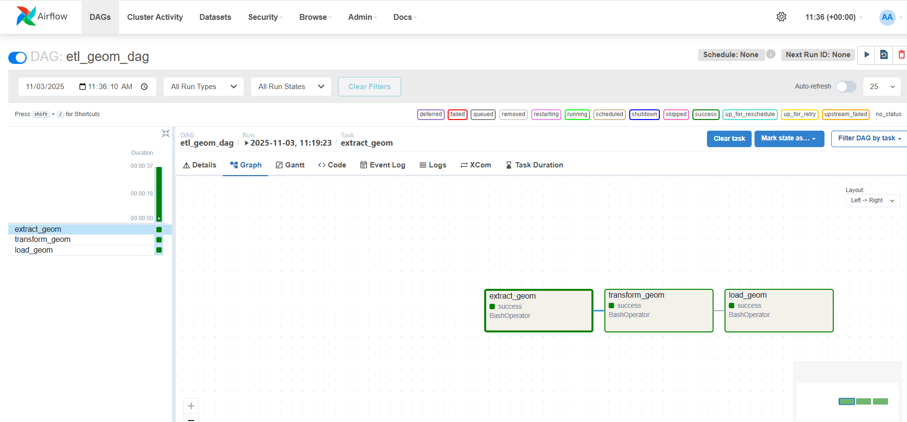
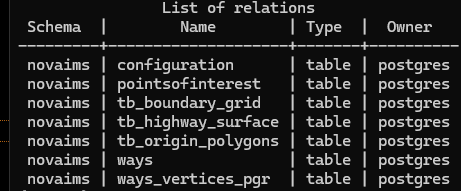
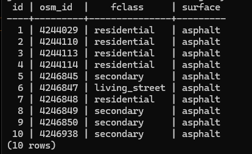
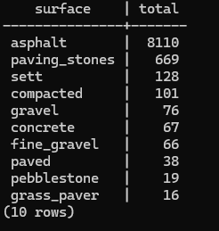

🗺️ OSM_ETL: Automated Geospatial ETL Pipeline with Airflow and PostGIS
🌍 Introduction

OSM_ETL is a fully containerized geospatial data pipeline that automates the extraction, transformation, and loading (ETL) of OpenStreetMap (OSM) data into a PostGIS database using Apache Airflow.
It integrates open geospatial tools such as osmconvert, osm2pgrouting, and the Overpass API to prepare structured spatial datasets for network analysis, surface mapping, and routing studies.

This workflow allows geospatial practitioners to streamline OSM data ingestion and ensure consistent, reproducible results.
All components — Airflow, PostGIS, and ETL scripts — run in isolated Docker containers, making it portable and easy to deploy on any system.

🎯 Purpose

The goal of this project is to automate the OSM data preparation process by:

Extracting and filtering raw OSM data within a region of interest.

Converting and importing road networks into a PostGIS database.

Enriching the data with surface attributes from the Overpass API.

Managing dependencies, scheduling, and logging using Apache Airflow.

🧱 Project Structure
OSM_ETL/
├── airflow/
│   ├── dags/                     # Airflow DAGs (task definitions)
│   │   ├── etl_geom_dag.py
│   │   └── etl_surface_dag.py
│   └── entrypoint.sh             # Airflow startup and initialization script
│
├── config/                       # Configuration files
│   ├── 00_proj.yml               # YAML config for ETL parameters
│   └── mapconfig_for_cars.xml    # OSM2PgRouting configuration
│
├── db/
│   └── create_tables.sql         # Database schema initialization (PostGIS tables)
│
├── etl/                          # Core ETL scripts
│   ├── etl_geom.py               # Geometry extraction and loading
│   └── etl_surface.py            # Surface attribute extraction via Overpass
│

├── .env.example                  # Example environment file (copy to .env)
├── docker-compose.yml            # Multi-container orchestration
├── Dockerfile.airflow            # Airflow build definition
├── Dockerfile                    # Base image configuration
├── requirements.txt              # Python dependencies
└── README.md

⚙️ Setup and Installation
1️⃣ Install Required Tools

Make sure the following are installed on your system:

Docker Desktop

Docker Compose

Check installation:

docker --version
docker compose version

2️⃣ Clone the Repository
git clone https://github.com/<your-username>/OSM_ETL.git
cd OSM_ETL

3️⃣ Configure Environment Variables

Duplicate the example environment file:

cp .env.example .env

Then open .env and fill in your credentials

4️⃣ Build and Start Containers

Run the entire system with:

docker compose up --build

This will:

Initialize the PostGIS database and create tables from /db/create_tables.sql

Build and start the Airflow web server and scheduler

Automatically create the admin Airflow user defined in .env

5️⃣ Access the Airflow Web Interface

Once containers are running, open:
👉 http://localhost:8080

Login using:

Username: admin  
Password: airflow

🧪 Checking if Everything Works Properly

Once Airflow is running:

In the Airflow UI, go to the DAGs tab.

You should see:

etl_geom_dag

etl_surface_dag

Trigger each DAG manually (click the ► toggle).

Watch the tasks (extract, transform, load) run under Graph View.

If successful, you’ll see green boxes (success) and logs under Task Instance Logs.

🗃️ Inspect the Database

Open the PostGIS shell:

docker exec -it etl_postgis psql -U postgres -d gisdb

Then check if tables exist:

\dt novaims.*;

And inspect data:

1. count number of rows in the table

SELECT COUNT(*) FROM novaims.tb_highway_surface;

2. Display 10 rows of the table

SELECT * FROM novaims.tb_highway_surface LIMIT 10;

3. Run aggregation 

 SELECT surface, COUNT(*) AS total
FROM novaims.tb_highway_surface
GROUP BY surface
ORDER BY total DESC
LIMIT 10;

🧩 Common Commands
Command	Description
bash docker compose up --build	Build and start all services
bash docker compose down	Stop and remove containers
bash docker compose logs -f airflow_etl	Stream Airflow logs
bash docker exec -it airflow_etl bash	Enter Airflow container shell
bash docker exec -it etl_postgis psql -U postgres -d gisdb	Access PostGIS database
🪪 License

This project is licensed under the MIT License.

📚 Credits

Developed by Enayat Meskinyaar
Master’s in Geospatial Technologies, Nova University of Lisbon & University of Münster
Supervising the integration of AI-ready ETL pipelines for spatial data automation.